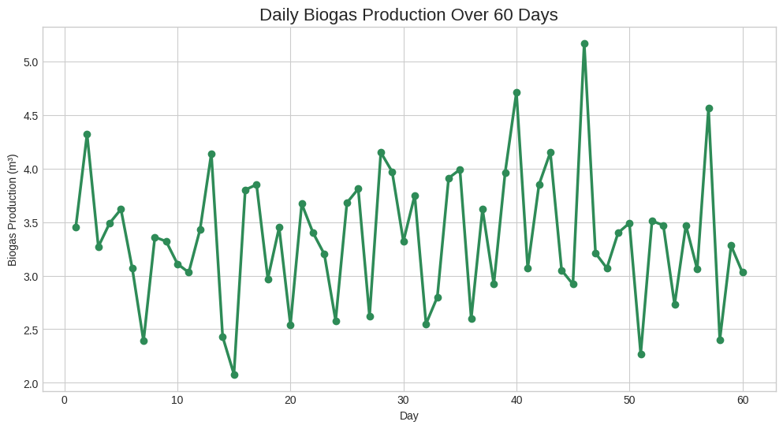
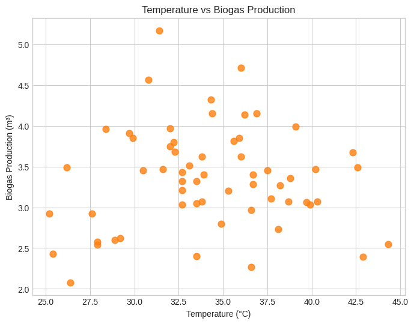
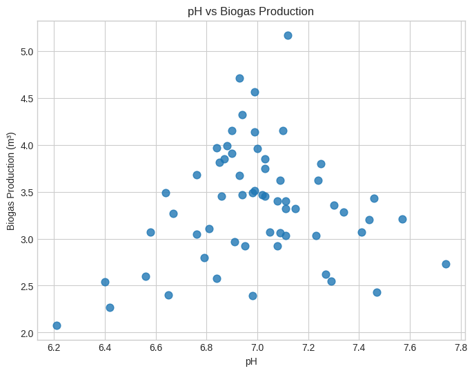
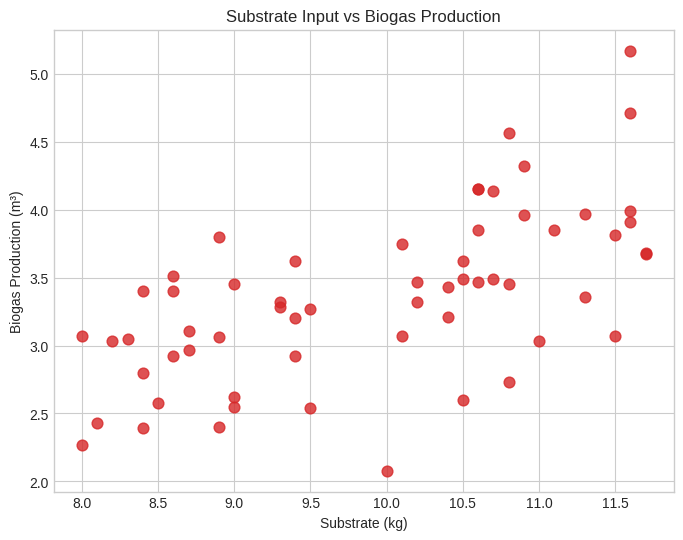

# Biogas Production Analysis Using Python

**Final Year Project**  
Exploratory Data Analysis of 60-day biogas production from an anaerobic digester.



### 👤 Author Information
**Osigbemhe Ikpaobo-Oghena**  
**Matric Number:** FET/CIE/17/37920  

- **Department:** Civil Engineering (CIE)  
- **Faculty:** Faculty of Engineering and Technology (FET)  
- **Institution:** Ambrose Alli University (AAU), Ekpoma, Edo State, Nigeria  

### 📊 Project Overview
This project performs **Exploratory Data Analysis (EDA)** on biogas production data collected over 60 days.  
It examines the relationship between key operational parameters and biogas yield:

- Temperature (°C)  
- pH level  
- Substrate input (kg)  
- Daily biogas production (m³)

The analysis focuses on data cleaning, visualization, and engineering insights relevant to **waste-to-energy systems** and **anaerobic digestion optimization**.

### 📌 Dataset Note
This dataset was **synthetically generated** based on realistic anaerobic digestion conditions (mesophilic temperature range ~30–42°C, pH ~6.2–7.7, typical substrate loading).  
It simulates real laboratory or small-scale biogas plant behavior and is ideal for demonstrating data analysis and interpretation in Civil/Environmental Engineering.

### 📈 Visualizations
  
  
  


### 📁 Project Structure
```
Biogas-Production-Analysis-Using-Python/
├── data/
│   ├── biogas_data.csv
│   ├── gas_vs_days.png
│   ├── temp_vs_biogas.png
│   ├── ph_vs_biogas.png
│   └── substrate_vs_biogas.png
├── Biogas Production Analysis Using Python.ipynb
└── README.md
```

### 🔍 Key Insights
- **Total biogas produced**: 201.49 m³ over 60 days  
- **Average daily production**: 3.36 m³/day  
- **Peak production**: Day 46 → **5.17 m³**  
- **Lowest production**: Day 15 → **2.08 m³**  

**Key Finding**:  
Substrate input shows the strongest positive correlation with biogas yield. Optimal performance occurs near neutral pH (~7.0) and mesophilic temperatures (35–40°C).

### 🛠 Technologies Used
- Python  
- Pandas (data cleaning & analysis)  
- Matplotlib (visualization)

### ▶️ How to Run
1. Open [`Biogas Production Analysis Using Python.ipynb`](Biogas%20Production%20Analysis%20Using%20Python.ipynb) in **Google Colab** (recommended) or Jupyter Notebook  
2. Run all cells  
3. All graphs will be generated automatically

### 🎯 Project Objectives
- Demonstrate data cleaning and preprocessing with Pandas  
- Perform exploratory data analysis (EDA)  
- Create clear engineering visualizations  
- Extract meaningful insights for biogas plant operation

### 📌 Applications
- Waste-to-Energy systems  
- Anaerobic digestion process monitoring  
- Environmental Engineering  
- Sustainable infrastructure and renewable energy planning

### 📜 License
This project is for **academic and educational purposes only**.

### 🤝 Acknowledgment
Developed as part of independent learning and final year project in Civil Engineering with focus on data-driven solutions for sustainable waste management.

---

**Made with ❤️ by Osigbemhe Ikpaobo-Oghena**
